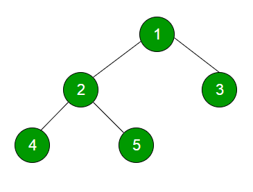

# Binary Tree Intro

  

*An example of a Binary Tree*

- **Binary** means 2 hence each node will have **at most** 2 nodes. 

## Terminologies of a Binary Tree

- Each element in a tree is called a **node**.

- The top most node is called the **root** node. In the above image,1 is the root node, while 2 is known as a **parent node** while 4 and 5 are known as **children** nodes to 2. Each parent node is connected to its child node through pointers which store the memory address of the children node.

- 4 and 5 are children nodes to 2 and both nodes have the same parent, they are known as the **sibling** nodes.

- Taking node 4, we can see nodes 2 and 1 are its **ancestor** nodes. Similarly, 4 is the **descendant** of 2 and 1.

- Node 3 is an example of a **leaf node** which refers to a node with no children.

## Different ways to traverse a Binary Tree

### PreOrder

- We traverse the root first, then followed by the left subtree and then the right subtree.

### InOrder

- We traverse the left first, then followed by the root and then the right subtree.

### PostOrder

- We traverse the left first, followed by the right subtree and then the root.

## Binary Tree Traversal

*Binary Tree we will traverse*

- **PreOrder Traversal Order:** 
  -  8 -> 10 -> 1 -> 9 -> 7 -> 6 -> 3 -> 13 -> 14

- **InOrder Traversal Order:**
  -  1 -> 10 -> 9 -> 6 -> 7 -> 8 -> 3 -> 13 -> 14

- **PostOrder Traversal Order:**(Bottom Up Style)
  - 1 -> 9 -> 7 -> 6 -> 10 -> 13 -> 14 -> 3

