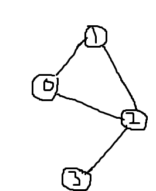

# Graph Representations

There are many ways to represent a graph data structure in C++. We will use the below graph example as a reference when seeing the various ways to represent a graph

## Adjacency Matrix

- 
